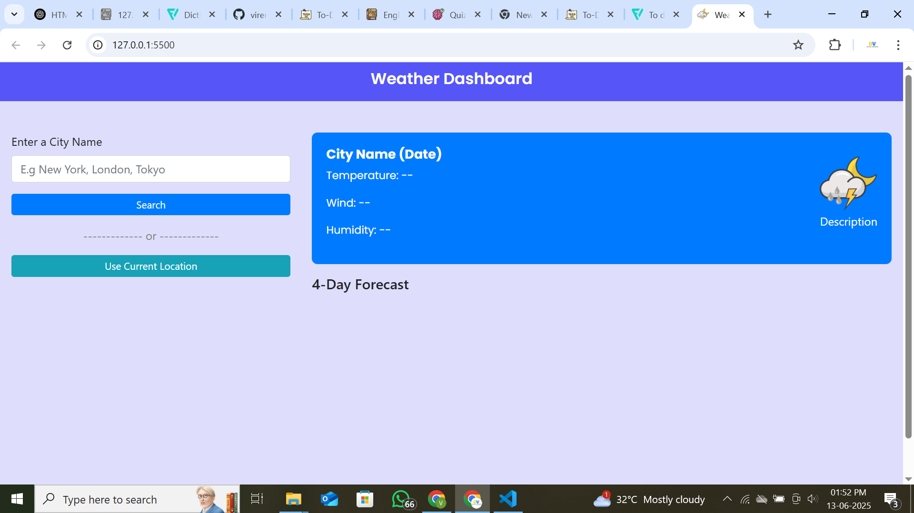
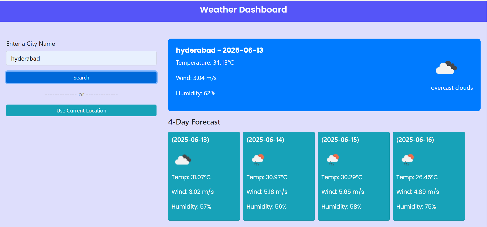

# 🌦️ Weather Dashboard

A responsive and user-friendly web application to search current weather and a 4-day forecast for any city using the **OpenWeatherMap API**. It also allows users to use their current location and saves recent search history using **localStorage**.

---

## 📝 Features

- 🌍 Search weather by city name  
- 📍 Use current device location (manual placeholder for future extension)  
- 🌡️ View current weather conditions: temperature, wind speed, and humidity  
- 📅 View a 4-day weather forecast at 12:00 PM each day  
- 🕘 Stores recent search history (last 5 cities)  
- 📱 Fully responsive layout using **Bootstrap**  
- 💾 Saves data in `localStorage`

---

## 💻 Tech Stack

| Technology | Description |
|------------|-------------|
| HTML5      | Structure of the app |
| CSS3       | Styling with custom and Bootstrap classes |
| JavaScript | Core logic and API integration |
| OpenWeatherMap API | Provides weather and forecast data |
| Bootstrap 4 | Responsive UI components |

---

🛠️ Usage

Open index.html in any browser

Enter a city name and click Search

View current weather and 4-day forecast

Or click Use Current Location (future enhancement)

Recently searched cities appear below the search box

🔧 Folder Structure

weather-dashboard/
├── index.html         # Main HTML page
├── style.css          # CSS styles
├── script.js          # JavaScript logic
├── weather-icon.png   # Default icon

🖼️ Screenshots

📌 Future Improvements

Add geolocation support for "Use Current Location"

Add loading spinner and error UI improvements

Toggle between Celsius and Fahrenheit

Dark/Light theme support

👨‍💻 Author
Virendra Sahu